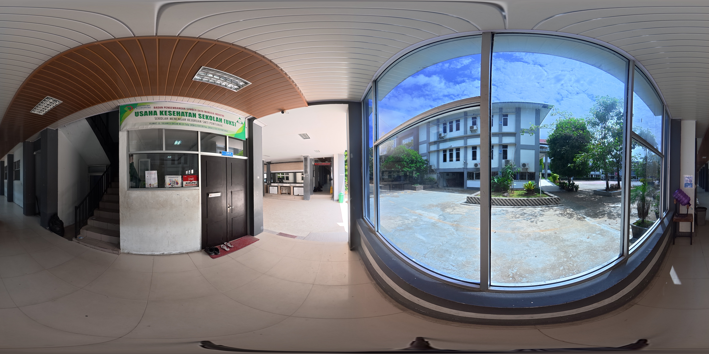
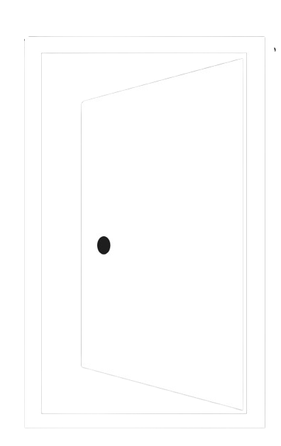

# Preview VR Tour

Preview Aplikasi Web VR Tour

# 🌐 Panduan Kontribusi VR Tour — SMK SMTI Pontianak

> **Hai!! Selamat datang di panduan kontribusi VR Tour ini!! 👋**
> Panduan ini ditulis sesimpel mungkin biar semua orang bisa ngerti cara nambahin konten ke tour ini.
> Gapapa kalau kamu masih baru ke web development — ikutin aja langkah-langkahnya pelan-pelan ya! 🐣

---

## 📋 Daftar Isi

1. [Gambaran Umum Proyek](#-gambaran-umum-proyek)
2. [Status & Goals Yang Belum Kelar](#-status--goals-yang-belum-kelar)
3. [Cara Ngerti Struktur File](#-cara-ngerti-struktur-file)
4. [Konvensi Penamaan File](#-konvensi-penamaan-file)
5. [Cara Nambah Titik Tour Baru](#-cara-nambah-titik-tour-baru)
   - [Kasus 1: Titik Biasa (Tidak Ada Pintu, Tidak Ada Video)](#kasus-1-titik-biasa-tidak-ada-pintu-tidak-ada-video)
   - [Kasus 2: Titik Yang Ada Tombol Masuk Ruangan](#kasus-2-titik-yang-ada-tombol-masuk-ruangan)
   - [Kasus 3: Titik Yang Ada Video YouTube](#kasus-3-titik-yang-ada-video-youtube)
6. [Aset & Sumber Daya](#-aset--sumber-daya)
7. [ID Harus Unik! (Penting Banget!!)](#-id-harus-unik-penting-banget)
8. [Fitur Yang Masih Perlu Dibuat](#-fitur-yang-masih-perlu-dibuat)
9. [Pesan Penutup ❤️](#-pesan-penutup)

---

## 🗺️ Gambaran Umum Proyek

VR Tour ini adalah aplikasi web yang memungkinkan orang-orang **menjelajahi lingkungan SMK SMTI Pontianak secara virtual** dari browser mereka — kayak Google Street View tapi buatan sendiri!

Teknologi yang dipakai:

- **A-Frame** — library JavaScript buat bikin scene 3D/VR di browser (lihat `1_TitikSatu.html` buat contohnya)
- **Foto 360°** — foto panorama yang ditaruh sebagai langit-langit (sky) di scene
- **HTML + CSS biasa** — buat tampilan UI overlay (header, minimap, tombol-tombol)

Kalau kamu buka salah satu file `.html`-nya di browser, kamu bakal bisa ngeliat 360° panorama dan bisa klik-klik panah buat pindah tempat. Sesimpel itu! ✨

---

## 🎯 Status & Goals Yang Belum Kelar

### Apa yang sudah ada sekarang ✅

- Halaman utama (`index.html`) dengan 2 panel: **Tur Virtual 360°** dan **Eksplor Jurusan**
- Tour dari depan sekolah → Gedung L → Area UKS → Masuk ke dalam UKS
- Sistem navigasi dengan panah GIF yang bisa di-hover dan klik
- Sistem pintu untuk masuk ke ruangan
- Komponen video YouTube (siap pakai, tinggal pasang)

### Yang masih perlu dikerjain ⏳

#### 1. 🎓 Tombol "Eksplor Jurusan" di index.html

Saat ini kalau kamu klik **"Lihat Jurusan"** di halaman utama, dia cuma munculin popup _"Sedang Dalam Pengembangan"_.

Yang perlu dibuat: saat diklik, tampilkan daftar pilihan jurusan seperti ini:

| Jurusan                    | Keterangan          |
| -------------------------- | ------------------- |
| 🔩 Teknik Pemesinan        | Lantai gedung Mesin |
| ⚙️ Teknik Otomasi Industri | TOI                 |
| 🧪 Kimia Industri          | KI                  |
| 🔬 Analisis Pengujian Lab  | APL                 |
| 🗣️ Lab Bahasa              | Lab Bahasa          |

Caranya nanti: ubah bagian `id="majors-btn"` di `index.html` supaya kalau diklik dia ngasih popup/halaman dengan 5 pilihan jurusan itu, dan masing-masing jurusan langsung link ke titik pertama di area jurusan tersebut.

#### 2. 📹 Video YouTube belum terpasang

Komponen YouTube sudah jadi, tapi video-video belum dipasang ke scene yang membutuhkannya. Link video ada di Google Drive (lihat bagian [Aset & Sumber Daya](#-aset--sumber-daya)).

#### 3. 🗺️ Minimap Zoom ke Area Tertentu

Saat ini minimap cuma nampilin gambar peta tanpa highlight area tertentu. Yang diinginkan: **ketika kamu lagi di area jurusan tertentu, minimap bisa zoom/highlight ke area tersebut** secara otomatis.

#### 4. 🏗️ Banyak Titik Lokasi Yang Belum Dibuat

Area Gedung L udah lumayan banyak, tapi gedung-gedung lain (LP, Mesin, Lab Bahasa, Kantin, Musholla, dll.) **belum dibuat sama sekali**. Semua ini menunggu kamu buat! 🚀

---

## 📁 Cara Ngerti Struktur File

```
PreviewVRTour/
│
├── index.html              ← Halaman utama (2 panel pilihan)
├── 0_TitikAwal.html        ← Titik pertama tour (depan sekolah)
├── 1_TitikSatu.html        ← Titik berikutnya (terus ke depan)
├── 2_TitikDua.html         ← Dan seterusnya...
├── 3_TitikTiga.html        ← Titik 3 (area Gedung L lantai 1)
├── 3a_TitikTiga.html       ← Titik 3 section a
├── 3b_TitikTiga.html       ← Titik 3 section b
│   ... dan seterusnya ...
├── 3k_TitikTiga.html       ← Titik 3 section k (depan UKS)
├── InRoom_3k.html          ← Scene DALAM ruangan UKS
│
├── assets/
│   ├── panoramas/          ← Semua foto 360° (.JPG)
│   ├── ui/                 ← Aset UI (arrow.gif, door_enter.png)
│   └── map/                ← Gambar-gambar peta minimap
│
├── css/
│   └── style.css           ← Semua styling tampilan
│
├── js/
│   ├── button-component.js ← Logic tombol navigasi & hover
│   ├── gif-shader.js       ← Biar GIF bisa muter di A-Frame
│   ├── ui-manager.js       ← Logic minimap, info panel, dll.
│   ├── gateway-manager.js  ← Logic halaman index.html
│   └── video-component.js  ← Komponen video YouTube (baru!)
│
├── PANDUAN_KONTRIBUSI.md   ← Ini! Panduan yang lagi kamu baca
└── Cara Memasukkan Video YT.md  ← Panduan khusus video YT
```

---

## 🔢 Konvensi Penamaan File

Ini penting banget biar namaing file kamu konsisten sama yang sudah ada!

### Format nama file: `[nomor gedung][lt{lantai}][section]_TitikNama.html`

| Bagian        | Artinya                                 | Contoh             |
| ------------- | --------------------------------------- | ------------------ |
| Angka depan   | Nomor gedung                            | `3` = Gedung L     |
| `lt` + angka  | Lantai berapa (opsional kalau lantai 1) | `lt2` = lantai 2   |
| Huruf section | Urutan section di lantai itu            | `a`, `b`, `c`, ... |

### Gedung yang sudah ada: **Gedung L = Nomor 3**

```
3a_TitikTiga.html     ← Gedung L, Lantai 1, Section a
3b_TitikTiga.html     ← Gedung L, Lantai 1, Section b
3k_TitikTiga.html     ← Gedung L, Lantai 1, Section k (depan UKS)
3Lt2a_TitikTiga.html  ← Gedung L, Lantai 2, Section a
3Lt3a_TitikTiga.html  ← Gedung L, Lantai 3, Section a
```

### Gedung-gedung lain: **Nomor 4**

```
4a_TitikEmpat.html    ← Gedung Lain (LP/Mesin/dll), Lantai 1, Section a
4b_TitikEmpat.html    ← Section b
4Lt2a_TitikEmpat.html ← Lantai 2, Section a
4Lt3a_TitikEmpat.html ← Lantai 3, Section a
```

> 💡 **Tips:** Lantai 1 gak perlu tulis `lt1`. Langsung aja `3a`, `4a`, dll. Kalau udah lantai 2 baru tulis `3lt2a`.

---

## ➕ Cara Nambah Titik Tour Baru

### Kasus 1: Titik Biasa (Tidak Ada Pintu, Tidak Ada Video)

Ini cara paling simpel! Tinggal copy-paste dari file yang sudah ada.

**Langkah-langkahnya:**

**1️⃣ Tentukan nama file baru dulu**
Misalnya kamu mau buat titik baru `3Lt2a_TitikTiga.html` (Gedung L, Lantai 2, Section a).

**2️⃣ Copy salah satu file yang mirip**
Copy file `3k_TitikTiga.html` (atau file manapun yang strukturnya mirip sama yang mau kamu buat), rename jadi nama baru kamu.

**3️⃣ Buka file baru itu, terus ganti bagian-bagian ini:**

**Section 1 — Nama tempat di header:**

```html
<!-- Cari ini: -->
<h1>Usaha Kesehatan Sekolah (UKS)</h1>
<p style="...">Ruang UKS Sekolah</p>

<!-- Ganti jadi: -->
<h1>NAMA TEMPAT KAMU</h1>
<p style="...">Sub judul atau deskripsi singkat</p>
```

**Section 2 — Deskripsi di tombol "i" (info):**

```html
<!-- Cari ini: -->
onclick="toggleInfo( 'Tentang Tour', 'Anda sedang berada di area di depan ruang UKS...' )"

<!-- Ganti isi teks dalam tanda kutip itu -->
```

**Section 3 — Foto 360° panorama:**

```html
<!-- Cari ini: -->


<!-- Ganti dengan foto panorama kamu: -->

```

> 📸 Taruh dulu foto panorama kamu di folder `assets/panoramas/`!

**Section 4 — Posisi kamera awal:**

```html
<!-- Cari ini (rotation="..."): -->
<a-entity id="camera-rig_hlmn3k" rotation="0.001 108.5 0.346">
  <!-- Kalau mau ubah arah kamera awal, ubah nilai rotation-nya -->
  <!-- Atau biarkan aja dulu, nanti bisa diatur pakai A-Frame Inspector --></a-entity
>
```

**Section 5 — Tombol panah navigasi:**

```html
<!-- Cari blok ini (Section 5): -->
<a-entity id="tombol-navigasi1_HLMN3k" position="..." rotation="..." scale="2 2 2">
  <a-entity
    id="panah-navigasi1_HLMN3a"
    class="itemButton"
    gif-shader="src: ./assets/ui/arrow.gif; transparent: true"
    geometry="primitive: plane"
    hoverable="opacity: 0.7"
    clickable="name: Titik_1; target_url: 3i_TitikTiga.html"
    ←
    GANTI
    INI
    scale="2 2 2"
    position="..."
    rotation="..."
  >
  </a-entity>

  <a-text value="Ikuti Panah \n Untuk Melanjutkan" ...></a-text>
</a-entity>
```

Ganti `target_url: 3i_TitikTiga.html` dengan file tujuan kamu.

Buat nambah **panah baru**, copy-paste seluruh blok `<a-entity id="tombol-navigasiX...">` dan ganti `position` + `rotation`-nya (gunakan A-Frame Inspector buat atur posisinya!).

**Minimap:**

```html
<!-- Cari ini: -->


<!-- Ganti dengan gambar peta yang sesuai: -->

```

> 🗺️ Taruh gambar peta kamu di folder `assets/map/`!

**4️⃣ Pastikan semua `id` unik!** (Baca bagian [ID Harus Unik](#-id-harus-unik-penting-banget) di bawah ya!)

---

### Kasus 2: Titik Yang Ada Tombol Masuk Ruangan

Kalau di titik kamu ada pintu yang bisa dimasuki (kayak pintu UKS di `3k_TitikTiga.html`), tambahin snippet ini di dalam `<a-scene>`:

**Langkah tambahan setelah Kasus 1:**

**1️⃣ Tambahkan asset gambar pintu** di dalam `<a-assets>` (kalau belum ada):

```html
<a-assets>
  
  
  
  <!-- ← Tambah ini -->
</a-assets>
```

**2️⃣ Copy snippet tombol pintu ini** dan taruh di dalam `<a-scene>`:

```html
<!-- ===== Snippet Tombol Masuk Ruangan (Copy Me!) ===== -->
<a-entity id="tombol-masuk-NAMA_UNIK" position="0 0 -5" ← Atur posisi pakai A-Frame Inspector rotation="0 0 0" ← Atur rotasi pakai A-Frame Inspector scale="2 2 2">
  <a-entity
    id="ikon-masuk-NAMA_UNIK"
    class="itemButton"
    geometry="primitive: plane"
    material="src: #door_enter; transparent: true; shader: flat"
    hoverable="opacity: 0.7"
    clickable="name: NamaRuangan; target_url: NAMA_FILE_RUANGAN.html"
    ←
    GANTI
    INI
    scale="1.5 1.5 1.5"
    position="4.08 -1.49 -1.49"
    rotation="21.21 -20.45 -35.56"
  >
  </a-entity>

  <a-text id="text-masuk-NAMA_UNIK" font="kelsonsans" width="6" align="center" value="Masuk NAMA RUANGAN" ← GANTI INI position="4.45 -0.82 -0.69" rotation="21.21 -20.45 -35.56" color="#fff"> </a-text>
</a-entity>
<!-- ===================================================== -->
```

> 🎯 **Setelah paste:** Pakai **A-Frame Inspector** (tekan `Ctrl+Alt+I` di browser) untuk atur posisi dan rotasi tombol biar tepat di depan pintu yang kamu mau!

---

### Kasus 3: Titik Yang Ada Video YouTube

Baca dulu file **`Cara Memasukkan Video YT.md`** yang ada di folder ini untuk instruksi lengkapnya!

Tapi intinya begini:

**1️⃣ Tambahkan script** di `<head>` file HTML kamu (setelah `button-component.js`):

```html
<script src="js/video-component.js"></script>
```

**2️⃣ Copy snippet ini** dan taruh di dalam `<a-scene>`:

```html
<!-- ===== YouTube Video Snippet (Copy Me!) ===== -->
<a-entity id="youtube-card-NAMA_UNIK" youtube-card="videoId: ID_VIDEO_YOUTUBE; title: Judul Video Disini" position="0 1.5 -5" ← Atur posisi pakai A-Frame Inspector rotation="0 0 0" scale="1 1 1"> </a-entity>
<!-- ============================================= -->
```

**3️⃣ Cari ID video YouTube:**

Dari link YouTube: `https://youtu.be/`**`dQw4w9WgXcQ`**

Bagian yang ditebal itu ID-nya (`dQw4w9WgXcQ`). Taruh di `videoId: ...`.

**Contoh:**

```html
youtube-card="videoId: dQw4w9WgXcQ; title: Profil Jurusan Teknik Pemesinan"
```

> 📹 **Link video YouTube** ada di Google Drive:
> `https://drive.google.com/drive/u/0/folders/17NuCwMAp9EPYcgSNMlXYbUcBlGdUBMPa`

---

## 📦 Aset & Sumber Daya

Semua foto, video, dan peta tersimpan di Google Drive. Kalau kamu butuh aset baru, download dari sini dulu!

| Jenis Aset                    | Link Google Drive                                                                            |
| ----------------------------- | -------------------------------------------------------------------------------------------- |
| 📸 Foto 360° & Peta Minimap   | [Klik di sini](https://drive.google.com/drive/u/0/folders/1sOTEVIOsEfHekUTdJTuV4IoxTw8O-RQf) |
| 📹 Video YouTube (link video) | [Klik di sini](https://drive.google.com/drive/u/0/folders/17NuCwMAp9EPYcgSNMlXYbUcBlGdUBMPa) |

**Setelah download:**

- Foto panorama (.JPG) → taruh di `assets/panoramas/`
- Gambar peta (.png) → taruh di `assets/map/`
- Video sudah di YouTube jadi cukup ambil ID-nya aja, gak perlu download!

---

## ⚠️ ID Harus Unik! (Penting Banget!!)

Ini **sering banget bikin bug** kalau dilupain!!

Setiap elemen HTML punya atribut `id="..."`. Di seluruh aplikasi VR Tour ini, **SEMUA ID HARUS BERBEDA**. Kalau ada 2 elemen punya ID yang sama, salah satunya gak bakal jalan.

**Cara gampang bikin ID unik:** tambahin nama singkat file-mu di belakang ID-nya.

Contoh: kalau kamu lagi di file `3Lt2a_TitikTiga.html`:

```html
<!-- SALAH ❌ (ID generik, mungkin udah ada di file lain) -->
<a-entity id="tombol-navigasi1">
  <a-entity id="panah-navigasi1">
    <a-text id="text-navigasi1">
      <!-- BENAR ✅ (ID unik pakai nama file) -->
      <a-entity id="tombol-navigasi1_3Lt2a">
        <a-entity id="panah-navigasi1_3Lt2a"> <a-text id="text-navigasi1_3Lt2a"></a-text></a-entity></a-entity></a-text></a-entity
></a-entity>
```

> 🔍 **Pro tip:** Sebelum buka di browser, tekan `Ctrl+F` di code editor dan cari ID yang kamu mau pakai. Kalau muncul lebih dari sekali di satu file, rename salah satunya!

---

## 🚧 Fitur Yang Masih Perlu Dibuat

Ini daftar hal-hal yang pengen ada di app ini tapi belum diimplementasikan. Ini buat referensi kamu kalau mau ngerjain yang lebih advance:

### 1. 🎓 Panel Pilihan Jurusan di `index.html`

- **Status:** Tombol "Lihat Jurusan" sudah ada tapi cuma munculin popup "Dalam Pengembangan"
- **Yang harus dilakukan:** Saat diklik, tampilkan popup/halaman baru dengan 5 pilihan jurusan. Masing-masing jurusan langsung link ke titik pertama di area jurusan tersebut.
- **File yang perlu diubah:** `index.html` dan `js/gateway-manager.js`

### 2. 🗺️ Minimap Zoom Otomatis ke Area Jurusan

- **Status:** Belum dibuat sama sekali
- **Yang harus dilakukan:** Ketika user lagi di file titik tertentu (misalnya area TOI), minimap otomatis zoom/highlight ke area TOI di peta. Bisa dilakukan dengan menambahkan CSS class atau koordinat zoom ke setiap file HTML.
- **File yang perlu diubah:** `js/ui-manager.js` dan setiap file HTML titik

### 3. 📹 Pasang Video YouTube ke Scene yang Membutuhkan

- **Status:** Komponen sudah siap (`js/video-component.js`), tapi belum dipasang ke scene manapun
- **Yang harus dilakukan:** Tentukan titik-titik mana yang butuh video, lalu pasang snippetnya (lihat Kasus 3 di atas)
- **Link video:** [Google Drive](https://drive.google.com/drive/u/0/folders/17NuCwMAp9EPYcgSNMlXYbUcBlGdUBMPa)

### 4. 🏗️ Buat Titik-Titik Lokasi Baru

- **Status:** Banyak area yang belum dibuat (Gedung Mesin, LP, Lab Bahasa, Kantin, Musholla, dll.)
- **Yang harus dilakukan:** Ikuti panduan di bagian [Cara Nambah Titik Tour Baru](#-cara-nambah-titik-tour-baru) untuk setiap lokasi baru
- **Penamaan:** Gunakan prefix `4` untuk gedung-gedung selain Gedung L (contoh: `4a_TitikEmpat.html`)

---

## 💌 Pesan Penutup

---

_To whoever continuing this VR tour,_

_I hope you're in a great condition, healthy, happy, and ready to contribute to this project happily!!!_

_I'm sorry if the guide doesn't look easy to read — I tried my best (by using AI) to make it easy to follow._

_I was too late to finish this project when I was still an intern in SMTI, so Pak Daniel told me to just add a guiding page kinda thing so people can continue making the tour easily._

_Goodluck to you — or maybe you guys — if this app is being continued to be developed as a team, and please continue this project with love!!_

_p.s. afuwwan 🗣️🔥_

_Wassalamu'alaikum Warahmatullahi Wabarakatuh_ 🌙

---

_Panduan ini dibuat dengan oleh Afuwwan & Antigravity AI_
_Last updated: Juni 2026_
